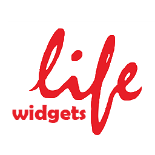

  
  <h1 align="center">Clean-life-widgets</h1>

    
  

Plugin with widgets for premium Wordpress theme "Clean Life"

## License

Clean-life-widgets is released under the [MIT License](https://github.com/UrijHoruzij/clean-life-widgets/blob/master/LICENSE).
